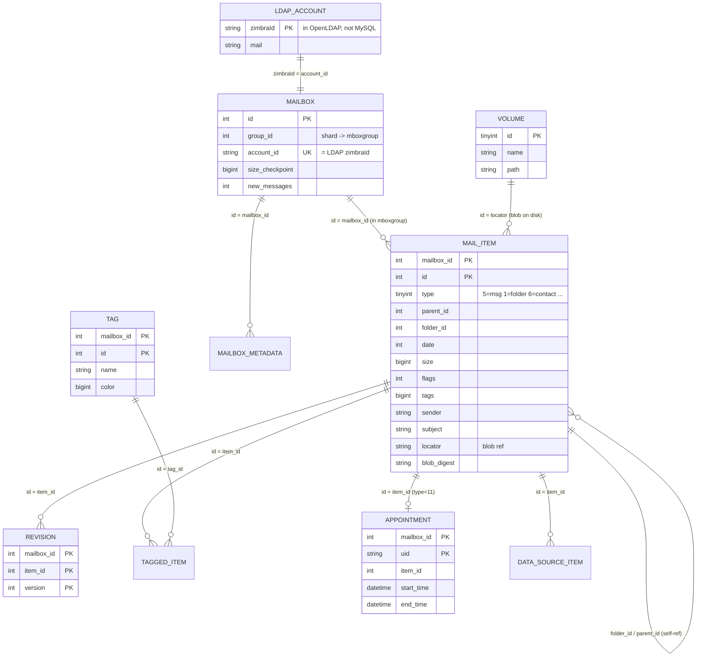

# Zimbra MySQL — Databases, Tables, ER Diagram

Extracted from the reference install via `information_schema`.

## Databases

| Database | Role |
| --- | --- |
| `zimbra` | Central metadata: account→mailbox mapping, volumes, config, sessions, scheduled tasks |
| `mboxgroup1` … `mboxgroup6` | Sharded per-mailbox item data. Each account is assigned to one group (`zimbra.mailbox.group_id`) |
| `chat` | Zimbra chat/IM storage (separate feature) |
| `mysql`, `information_schema`, `performance_schema`, `test` | Server internals |

Sharding: `zimbra.mailbox.group_id = N` → that mailbox's rows live in
`mboxgroup<N>`, keyed by `mailbox_id = zimbra.mailbox.id`. Every `mboxgroup`
database has an **identical set of tables**.

## Tables

### `zimbra` (central)

| Table | Purpose |
| --- | --- |
| `mailbox` | One row per mailbox: `account_id` (LDAP zimbraId), `group_id` (shard), checkpoints, quota-usage counters |
| `mailbox_metadata` | Per-mailbox key/value blobs (`section` → `metadata`) |
| `config` | Server config key/value (schema version, redolog seq, etc.) |
| `volume`, `volume_blobs`, `current_volumes` | Blob store volumes (where message files live) |
| `current_sessions` | Active mailbox sessions |
| `out_of_office` | Vacation/OOO send tracking |
| `scheduled_task` | Data-source polling and other scheduled jobs |
| `deleted_account` | Tombstones for deleted accounts |
| `mobile_devices`, `zmg_devices` | EAS / push device registrations |
| `pending_acl_push`, `service_status`, `table_maintenance` | Housekeeping |

### `mboxgroup<N>` (per-mailbox, sharded)

| Table | Purpose |
| --- | --- |
| `mail_item` | **The core table.** Every folder, message, conversation, contact, appointment, document, etc. is a row here, discriminated by `type` |
| `mail_item_dumpster` | Soft-deleted `mail_item` rows (recoverable "dumpster") |
| `revision`, `revision_dumpster` | Prior versions of items (documents, drafts) |
| `tag`, `tagged_item` | User tags and the item↔tag join |
| `imap_folder`, `imap_message` | IMAP data-source sync state (external accounts) |
| `pop3_message` | POP3 data-source dedupe (UIDL tracking) |
| `appointment`, `appointment_dumpster` | Calendar time-range index over `mail_item` appointments |
| `data_source_item` | Maps external data-source items to local `mail_item`s |
| `open_conversation`, `purged_conversations`, `purged_messages` | Conversation threading / purge bookkeeping |
| `tombstone` | Sync tombstones (deleted-item ids for delta sync) |
| `event`, `watch` | Change-notification bookkeeping |

## `mail_item.type` discriminator

The single most important field. Common values:

| `type` | Item |
| --- | --- |
| 1 | Folder |
| 3 | Conversation (thread parent) |
| 5 | Message |
| 6 | Contact |
| 8 | Mountpoint (shared folder link) |
| 11 | Appointment |
| 13 | Document (Briefcase) |
| 14 | Task |
| 15 | Wiki/Notebook |
| 18 | Chat |

Folders are themselves `mail_item` rows, so `mail_item.folder_id` is a
**self-reference** to another `mail_item.id` (with `type=1`). Conversations use
`parent_id` the same way.

## Entity-Relationship Diagram

## Why this matters for the admin panel

Our panel is a **provisioning** tool (accounts/domains/aliases/admins) — that is
LDAP-land, not mailbox-metadata land. The MySQL mailbox tables are only
interesting to us **read-only**, for reporting features Zimbra has that
PostfixAdmin does not: real mailbox size, message counts, last-activity, quota
usage. See [05-architecture-reuse.md](05-architecture-reuse.md).
