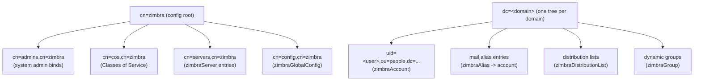

# Zimbra OpenLDAP — Directory Structure

The directory is the authoritative store for provisioning objects — exactly the
domain our admin panel manages. Extracted via `zmprov` / `ldapsearch` on the
reference install.

- LDAP URL: `ldap://mail.zimbra.test:389`
- Admin bind DN: `uid=zimbra,cn=admins,cn=zimbra`
- Reference counts: 3 domains, 43 accounts, 2 COS

## Object classes per entity

| Entity | objectClasses |
| --- | --- |
| Account | `inetOrgPerson`, `zimbraAccount`, `amavisAccount` |
| Domain | `dcObject`, `organization`, `zimbraDomain`, `amavisAccount` |
| Class of Service (COS) | `zimbraCOS` |
| Alias / DL / Server / Global config | `zimbraAlias`, `zimbraDistributionList`, `zimbraServer`, `zimbraGlobalConfig` (standard Zimbra classes) |

Standard classes (`inetOrgPerson`, `dcObject`, `organization`) carry the
familiar directory attributes; the `zimbra*` classes add Zimbra's ~thousands of
configuration attributes.

## Directory Information Tree (DIT)

- Config-side objects (COS, servers, global config, admins) hang under
  `cn=zimbra`.
- Each **domain** is a `dc=` subtree; accounts live under `ou=people` in it.

## Key attributes by entity

Only the operationally important attributes are listed. An account exposes
~450 `zimbra*` attributes; a COS **495**. The full set is Zimbra's feature/pref
matrix and is not reproduced here — query it live with `zmprov ga|gd|gc`.

### Account (`zimbraAccount`)

| Group | Attributes |
| --- | --- |
| Identity | `zimbraId` (stable UUID → MySQL `mailbox.account_id`), `mail`, `cn`, `sn`, `displayName`, `uid`, `userPassword` |
| Status / role | `zimbraAccountStatus` (active/locked/closed/…), `zimbraIsAdminAccount`, `zimbraIsDelegatedAdminAccount`, `zimbraUserType` |
| Routing | `zimbraMailHost`, `zimbraMailTransport`, `zimbraMailDeliveryAddress`, `zimbraMailStatus` |
| Quota | `zimbraMailQuota`, `zimbraMailQuotaSoftLimitPercent` |
| Membership | `zimbraCOSId` (→ COS), `zimbraMailAlias` (aliases) |
| Activity | `zimbraLastLogonTimestamp`, `zimbraCreateTimestamp`, `zimbraPasswordModifiedTime` |
| Password policy | `zimbraPasswordMinLength`, `…MaxAge`, `…LockoutEnabled`, `…LockoutMaxFailures` (also settable on COS/domain) |
| Feature flags | ~200 `zimbraFeature*Enabled` toggles (mail, calendar, chat, briefcase, 2FA, …) |
| Preferences | ~250 `zimbraPref*` per-user settings |

### Domain (`zimbraDomain`)

| Group | Attributes |
| --- | --- |
| Identity | `zimbraDomainName`, `zimbraId`, `dc`, `o` |
| Status / type | `zimbraDomainStatus`, `zimbraDomainType` (local/alias) |
| Mail | `zimbraMailStatus`, `zimbraMailDomainQuota`, `zimbraDomainAggregateQuota*` |
| GAL | `zimbraGalMode`, `zimbraGalLdapAttrMap`, `zimbraGalMaxResults`, `zimbraGalInternalSearchBase` |
| Admin console | `zimbraAdminConsoleCatchAllAddressEnabled`, `zimbraAdminConsoleLDAPAuthEnabled`, `zimbraSkinLogoURL` |
| Auth | `zimbraAuthMech`, `zimbraBasicAuthRealm`, `zimbraReverseProxyClientCertMode` |

### Class of Service (`zimbraCOS`)

A COS is its own `zimbraCOS` object class — a **named bundle of defaults**
applied to every account that references it via `zimbraCOSId`. It defines
**many account-inheritable feature/pref/quota/password defaults** (the reference
COS exposes 495 such attributes), providing the values an account inherits
unless overridden. It does **not** carry account identity/routing/membership
fields. This is the big capability PostfixAdmin has no equivalent for.

## Mapping: Zimbra LDAP → our current PostfixAdmin schema

| Concept | Zimbra (LDAP) | go-snappymail admin (SQL) |
| --- | --- | --- |
| Account | `zimbraAccount` entry | `mailbox` row |
| Account id | `zimbraId` (UUID) | `username` (email) |
| Status | `zimbraAccountStatus` | `active` (bool) |
| Quota | `zimbraMailQuota` | `mailbox.quota` |
| Domain | `zimbraDomain` entry | `domain` row |
| Alias | `zimbraAlias` → target | `alias` row (`address`→`goto`) |
| Distribution list | `zimbraDistributionList` | *(no equivalent — alias w/ many targets)* |
| Class of Service | `zimbraCOS` | *(no equivalent)* |
| Admin | `zimbraIsAdminAccount=TRUE` | `admin` / `domain_admins` rows |
| Delegated admin | `zimbraIsDelegatedAdminAccount` + grants | `domain_admins` scope |

The two models are **conceptually parallel** for the core objects
(account/domain/alias/admin). The gaps — COS, distribution lists, per-account
feature flags, delegated-admin grants — are what we could borrow ideas from.
