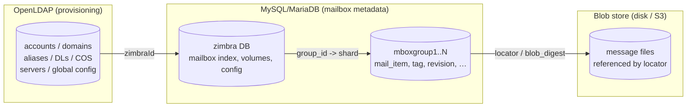
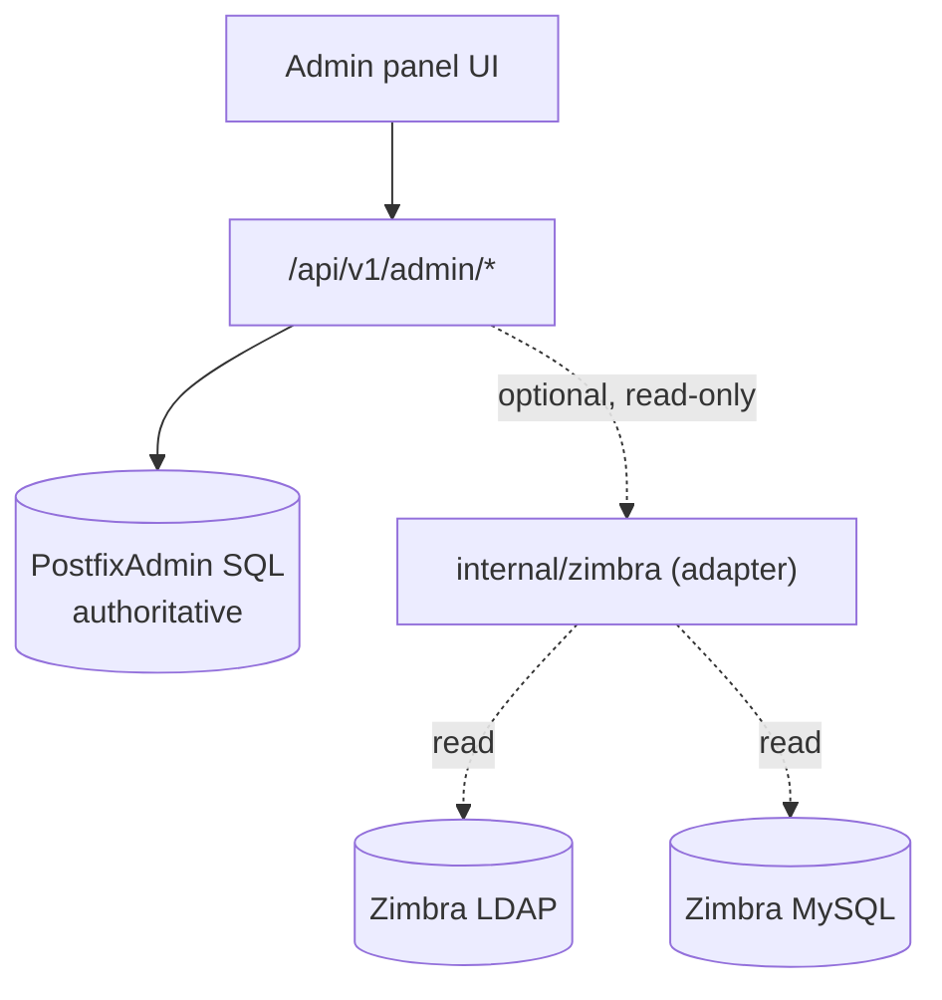

# Zimbra Architecture + Reuse Analysis

What the legacy stores are, how they fit together, and — the real question —
**what (if anything) we should reuse or emulate in the go-snappymail admin panel.**

## Architecture (data stores only)

- **LDAP** answers "who exists, what can they do" (provisioning).
- **MySQL** answers "what's in each mailbox" (metadata), sharded per mailbox.
- **Blob store** holds the actual message bytes; MySQL only references them.

The join key across all three is the account's **`zimbraId`** (LDAP) =
`zimbra.mailbox.account_id` (MySQL) → `group_id` → shard → `locator` → blob.

## Our panel today vs Zimbra

| | go-snappymail admin | Zimbra |
| --- | --- | --- |
| Provisioning store | PostfixAdmin SQL (`domain`,`mailbox`,`alias`,`admin`) | OpenLDAP |
| Mailbox metadata | none (Dovecot owns it) | MySQL `mboxgroup<N>` |
| Objects managed | domains, accounts, aliases, admins | + COS, DLs, resources, servers, GAL |
| Per-account features | none | ~200 feature flags + ~250 prefs |

## Can we reuse Zimbra's actual data? — No (and why)

- **LDAP**: our stack authenticates against the PostfixAdmin SQL schema +
  Dovecot, not Zimbra's LDAP. Pointing at Zimbra's LDAP would mean adopting
  Zimbra's whole auth/provisioning model. Out of scope.
- **MySQL mailbox tables**: these describe a **Zimbra mailstore**, which we
  don't run (we use Dovecot/Maildir). The rows are meaningless without the
  Zimbra mailbox server. Not reusable as storage.
- **Blob store**: Zimbra-specific layout. Not reusable.

> Conclusion: we do **not** reuse Zimbra's databases as-is. The value is in
> **borrowing concepts and, for a migration/coexistence scenario, reading them.**

## What we *can* borrow (ranked)

1. **Class of Service (COS) concept** — a named bundle of quota + feature +
   password-policy defaults applied to many accounts. High value; PostfixAdmin
   has nothing like it. Could add a `cos` table + `mailbox.cos_id` and inherit
   defaults. See [04-ldap-structure.md](04-ldap-structure.md).
2. **Distribution lists** as first-class objects (not just multi-target
   aliases) — membership management, "expand members", owners.
3. **Per-account activity/usage reporting** — real mailbox size, message count,
   last-login. If we ever run against a Zimbra store (migration/coexistence),
   the read-only GORM models in [03-gorm-models.md](03-gorm-models.md) give us
   `size_checkpoint`, `new_messages`, `last_soap_access` directly.
4. **Delegated-admin model** — Zimbra's fine-grained grants are richer than our
   domain-scoped `domain_admins`. A `grant`/`right` table could generalize it.
5. **Account status vocabulary** — `active/locked/closed/pending/maintenance`
   vs our single `active` bool. A small enum would be more expressive.

## What we should *not* do

- Don't AutoMigrate against, or write to, any Zimbra store.
- Don't try to embed Zimbra's 495-attribute COS wholesale — cherry-pick the
  handful of settings we actually expose (quota, a few feature toggles,
  password policy).
- Don't couple the panel to LDAP; keep the SQL provisioning model and treat
  Zimbra reads (if any) as an optional, isolated, read-only adapter.

## If we pursue "read Zimbra for reporting/migration"

A future, **isolated** `internal/zimbra/` package (read-only), used only when an
operator points the panel at a Zimbra box for a migration dashboard:

Strictly read-only, feature-flagged, and never on the provisioning write path.
