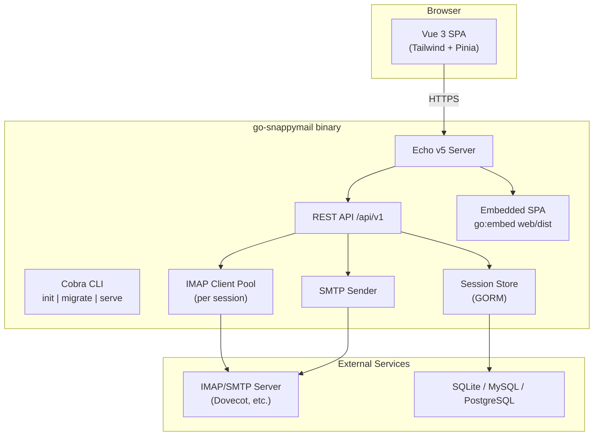

## Context

go-snappymail is a greenfield project. The workspace contains a read-only SnappyMail PHP reference at `base/snappymail/` and the author's existing Go webmail at `go-cubemail/` (Echo v5, Vue 3, embedded SPA). The goal is SnappyMail UI/UX parity with go-cubemail's operational model: one binary, no PHP, IMAP/SMTP passthrough.

SnappyMail's frontend uses Knockout.js with a 3-column layout (folders | messages | message view), Squire rich-text editor, dark themes, PGP via OpenPGP.js, and ManageSieve for filters. The backend is PHP with JSON Ajax actions (`DoMessageList`, `DoSendMessage`, etc.) and optional SQLite/MySQL for contacts and settings.

## Goals / Non-Goals

**Goals:**

- Single Go binary with embedded Vue 3 SPA (build-time embed, runtime serve).
- SnappyMail-like UI: 3-column layout, folder tree with unread badges, message list with threads, reading pane, composer modal, dark/light themes.
- Core mail via IMAP/SMTP: folders, read, flag, move, delete, compose, search, attachments.
- Session-based auth validated against IMAP LOGIN.
- REST API (`/api/v1/*`) with Swagger docs, CSRF, security headers.
- Reuse go-cubemail patterns for server bootstrap, handlers, middleware, and frontend store architecture.

**Non-Goals (v1):**

- CalDAV/CardDAV/ActiveSync servers.
- SnappyMail PHP plugin (.phar) compatibility.
- RainLoop JSON Ajax API compatibility.
- POP3 support.

## Decisions

### D1: Architecture — mirror go-cubemail single-binary pattern

**Choice:** Cobra CLI + Echo v5 + `go:embed web/dist` + GORM.

**Rationale:** Proven in go-cubemail; minimizes ops (one file deploy), shares handler/middleware code patterns.

**Alternatives considered:**
- Separate frontend container (nginx + Go API) — rejected; adds deployment complexity.
- Fiber instead of Echo — rejected; go-cubemail already standardizes on Echo v5.

### D2: API style — REST JSON, not SnappyMail Ajax actions

**Choice:** Versioned REST endpoints (`GET /api/v1/mail/:mailbox`, `POST /api/v1/compose/send`).

**Rationale:** Cleaner for Vue/Pinia, Swagger-documentable, matches go-cubemail. SnappyMail's `?/Ajax/` action names are an implementation detail of PHP RainLoop.

**Alternatives considered:**
- RainLoop-compatible Ajax shim — rejected; adds complexity with no user benefit.

### D3: IMAP library — emersion/go-imap/v2

**Choice:** Same as go-cubemail.

**Rationale:** Modern Go IMAP client, active maintenance, supports UID operations, SEARCH, SORT.

### D4: Frontend stack — Vue 3 + Tailwind CSS v4 + Pinia

**Choice:** Vue 3 SPA with Tailwind, TipTap editor, Lucide icons.

**Rationale:** Matches go-cubemail toolchain. SnappyMail's Knockout.js is legacy; Vue 3 gives component reusability and TypeScript safety.

**UI mapping (SnappyMail → Vue components):**

| SnappyMail (Knockout) | go-snappymail (Vue 3) |
|---|---|
| Folder list sidebar | `FolderSidebar.vue` |
| Message list | `MessageList.vue` |
| Message view / reading pane | `ReadingPane.vue` |
| Compose popup | `ComposerModal.vue` |
| Settings screen | `SettingsPane.vue` |
| Contacts | `ContactsPane.vue` |
| Login | `LoginView.vue` |
| Top toolbar (search, refresh) | `AppToolbar.vue` |
| System folders bar | `SystemFolders.vue` |

### D5: Session storage — server-side DB sessions

**Choice:** Cookie `gsn_session` + GORM session table (same pattern as go-cubemail's `gorc_session`).

**Rationale:** IMAP credentials stored encrypted in session; no JWT in localStorage (XSS risk).

### D6: Database — SQLite default, MySQL/PostgreSQL optional

**Choice:** GORM with SQLite for dev/single-user; MariaDB/PostgreSQL for production.

**Stores:** sessions, user settings, contacts, identities, PGP key metadata (phase 2). **Does NOT store** mail bodies.

### D7: Real-time updates — SSE for new mail notifications

**Choice:** Server-Sent Events endpoint `/api/v1/events` (reuse go-cubemail SSE pattern).

**Rationale:** SnappyMail polls via Ajax; SSE is more efficient and already implemented in go-cubemail.

### D8: Theming — Tailwind dark mode + CSS variables

**Choice:** Tailwind `dark:` variants + CSS custom properties for SnappyMail theme colors (Default, NightShine, Clear themes as reference from `base/snappymail/.../themes/`).

### D10: Go engineering standards (golang-* skills)

**Choice:** Apply idiomatic Go patterns from project skills across all packages.

| Concern | Standard |
|---|---|
| Logging | `log/slog` structured JSON in production; text handler in debug mode |
| Errors | Wrap with `fmt.Errorf("context: %w", err)`; never swallow IMAP/SMTP failures |
| Security | AES-GCM for session passwords; CSRF double-submit; rate limit login; bluemonday for HTML |
| Observability | Request ID middleware; log `user`, `mailbox`, `uid` on mail ops (never passwords) |
| Testing | Table-driven tests for handlers and IMAP wrapper; `httptest` for API routes |
| Interfaces | `IMAPClient`, `MailSender`, `SessionStore` interfaces for test doubles |
| Concurrency | Context cancellation on IMAP ops; bounded connection pool per session |
| Config | Viper + `GOSM_` env prefix; validate `secret_key` length at startup |

**Rationale:** Keeps go-snappymail maintainable and aligned with go-cubemail quality bar without importing it as a module.

### D11: Lab comparison stack (Docker)

**Choice:** Side-by-side validation on VM `192.168.56.20`:

| Service | Port | Role |
|---|---|---|
| go-cubemail | 8080 | Go reference webmail |
| PostfixAdmin | 8081 | Mailbox admin |
| **go-snappymail** | **8082** | This project (SnappyMail UX) |
| SnappyMail PHP | 8888 | UX/behavior reference |

All share `mailserver` (Postfix+Dovecot) on Docker network `gosm`. P0 ships a minimal login SPA on 8082; P1+ adds full 3-column UI for visual diff against 8888.

### D9: Code reuse from go-cubemail

**Choice:** Copy-adapt (not import as module) handler patterns, middleware (CSRF, security headers, auth), IMAP/SMTP wrappers, and frontend store structure.

**Rationale:** Separate repos; go-snappymail is a distinct product with SnappyMail UX focus. Shared patterns, not shared dependency.

## Architecture



## Project Layout

```
go-snappymail/
├── main.go                    # embed + cmd.Execute
├── cmd/                       # Cobra: init, migrate, serve, version
├── internal/
│   ├── config/                # Viper TOML config
│   ├── handler/               # Echo handlers (auth, mailbox, message, compose, ...)
│   ├── imap/                  # IMAP client wrapper
│   ├── smtp/                  # SMTP sender
│   ├── session/               # Session management
│   ├── repository/            # GORM repos (contacts, settings, identities)
│   └── server/                # Echo setup, routes, middleware
├── frontend/                  # Vue 3 source
│   ├── src/
│   │   ├── components/        # UI components (SnappyMail layout)
│   │   ├── stores/            # Pinia stores (auth, mail, settings)
│   │   └── utils/             # API client, SSE, keyboard shortcuts
│   └── package.json
├── web/dist/                  # Vite build output (embedded)
├── docs/                      # Swagger generated
├── Makefile                   # make all = frontend + go build
└── base/snappymail/           # Reference only (not compiled)
```

## Phased Delivery

**Rule: backend first, frontend second.** For every feature slice, ship the Go REST API (handlers, IMAP/SMTP, tests, Swagger) before Vue components. The minimal `web/dist/index.html` placeholder is enough until P1 backend is complete.

| Phase | Backend (Go) | Frontend (Vue) |
|---|---|---|
| **P0 — Foundation** | CLI, config, DB, Echo, auth API | Placeholder login HTML only |
| **P1 — Core Mail** | Folders, messages, compose/send, search APIs + tests | Deferred until P1 backend done |
| **P2 — UI Parity** | SSE events, HTML sanitization API | 3-column layout, dark mode, shortcuts |
| **P3 — Contacts & Settings** | Contacts, identities, settings CRUD | Settings/contacts panes |
| **P4 — Advanced** | PGP metadata, Sieve, admin API | PGP UI, filter editor, admin panel |

| Phase | Scope | Target |
|---|---|---|
| **P0 — Foundation** | CLI, config, DB, Echo server, auth API, embed placeholder | Runnable binary with login |
| **P1 — Core Mail** | Folders, message list/read, flag/move/delete, compose/send | Usable webmail (API-first) |
| **P2 — UI Parity** | SnappyMail layout polish, dark mode, keyboard shortcuts, SSE notifications | Visual parity |
| **P3 — Contacts & Settings** | Address book, identities, signatures, preferences | Feature parity (basic) |
| **P4 — Advanced** | PGP, Sieve filters, admin panel | SnappyMail differentiators |

## Risks / Trade-offs

| Risk | Mitigation |
|---|---|
| UI parity gap vs SnappyMail | Use `base/snappymail/` themes/CSS as visual reference; side-by-side screenshots in CI |
| IMAP server compatibility | Test against Dovecot + common providers; abstract IMAP ops behind wrapper |
| PGP complexity | Defer to P4; use OpenPGP.js client-side like SnappyMail |
| Duplicating go-cubemail code | Document shared patterns; consider extracting common lib later |
| AGPL vs MIT | Clean-room reimplementation; no PHP code copy; reference behavior only |
| Threading/conversation view | Start with flat list; add IMAP THREAD extension in P2 |

## Migration Plan

Not applicable — greenfield project. Deployment:

1. `./go-snappymail init` → generates `config.toml`
2. `./go-snappymail migrate` → creates DB tables
3. `./go-snappymail serve` → listens on `:8082` (default in config)
4. Optional: systemd unit + reverse proxy (Caddy/nginx) with TLS

## Resolved Decisions (formerly Open Questions)

1. **Module name**: `go-snappymail`
2. **Config prefix**: `GOSM_` environment variables
3. **Contacts storage**: DB-only (like go-cubemail); no CardDAV read in v1
4. **Admin panel scope**: defer entirely to P4
5. **Shared library**: defer; copy-adapt patterns from go-cubemail for now

## Open Questions

1. **New mail detection**: IMAP IDLE per active session vs server-side polling interval — decide during P2 SSE implementation based on connection pool limits.
2. **Search scope limits**: max folders searched per query and timeout — decide during P1 based on IMAP server testing.
